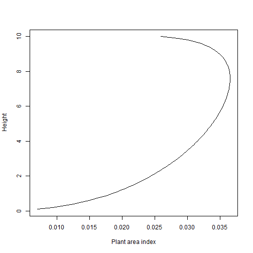
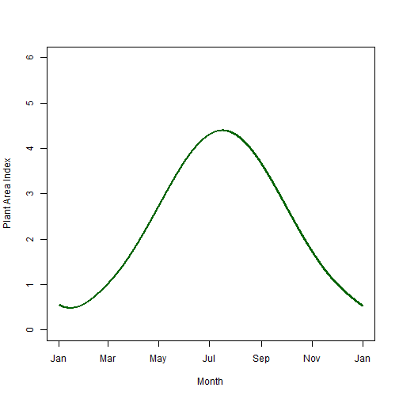
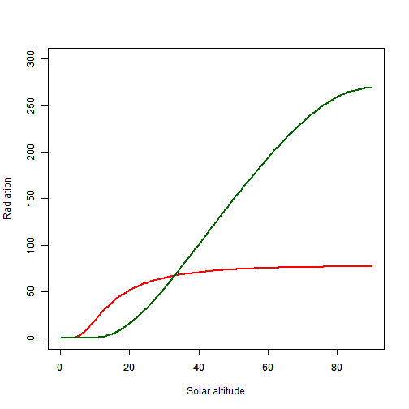
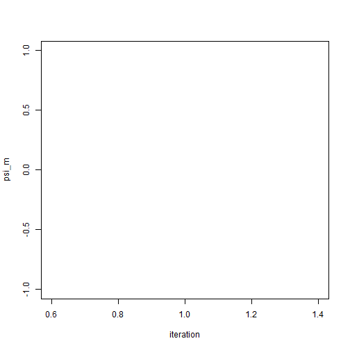
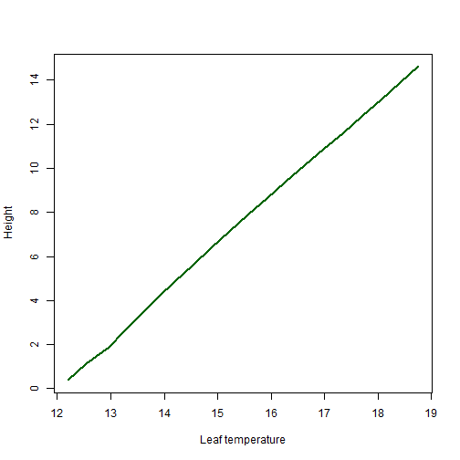
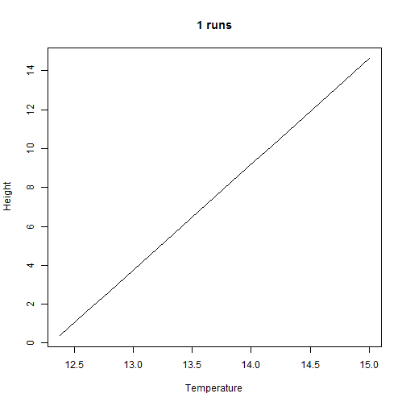

## Introduction
This vignette describes the R package ‘microclimc’. In conjunction with `microctools`, the package contains a series of functions for modelling microclimate from first principles, below or above vegetated canopies and in the soil. The core assumption is that local anomalies from standard reference temperature or humidity, for example weather station data, can be modelled using the mechanistic processes that govern heat and vapour exchange.
The modelling of temperatures above canopy is performed using classic one-dimensional diffusion theory (also known as K-theory). It is assumed that air does not absorb or emit radiation, but that the canopy itself does. The air immediately above the canopy is influenced by convective heat exchange with canopy. This in turn is governed by turbulent transport, whereby conductivity between the canopy and the air above it is determined by the shape of the wind profile, itself dependent on vegetation roughness as well as the wind speed at some measurable height.

Modelling microclimate below canopy is less straightforward as understanding of the turbulence dynamics, and hence the exchange of vapour and heat within canopies continues to be an area of active research. Early work tried to relate observed wind and temperature profiles to local turbulent fluxes using K-theory. However K-theory only applies when the scale of the mechanism is much smaller than that of the gradient. It was originally thought that turbulence was generated mainly in the wakes behind leaves etc., but more recent evidence suggest large, coherent eddies are often primary mechanisms governing heat transfer. While alternative approaches, including Lanrangian and Eulerian advection-diffusion models have been used with some success, it is generally acknowledged that parameterise the models with field data is extremely challenging. Nevertheless, based on the assumptions that (1) the distribution of radiant energy in the canopy can be expressed as function of cumulative leaf area, (2) net radiation absorbed by each leaf can be partitioned between sensible and latent heat, (3) heat and vapour transfer is governed by wind speeds, which in turn can be approximated adequately with knowledge of the density of the canopy and (4) conditions within the canopy are often quite closely coupled with those above canopy, it is possible to realistically model below-canopy microclimates.

This is achieved by dividing the canopy into a specific number of layers and running the model in time-steps. Standard heat and water-balance equations are used to model heat and vapour exchanges between leaves and air and with the surface layer of the ground and the air above canopy, and by linearising the equations, the temperature and humidity of each are resolved. Both transient (significant heat storage) and steady-state balances are considered, and the model automatically determines which is appropriate. Heat and vapour exchange between each canopy layer are also modelled simultaneously by means of Gauss elimination using the Thomas algorithm. A closed-form solution to this problem necessitates boundary conditions to be set. The upper boundary limits are the above canopy temperature and humidity of the air, which form the inputs to the model. The lower boundary conditions are set by simultaneously considering soil temperatures at a specified number of depths (see below). The boundary condition at the bottom of the soil column is specified as remaining at some constant, measured temperature, which if unknown is assumed to be equivalent to mean annual air temperature. Heat storage within each layer, particularly relevant for soil temperature, is explicitly considered, but to avoid the fluxes exceeding the heat capacity of air layers, the air layers are automatically merged to fewer layers if necessary.

Soil temperatures at specific depths are resolved using the Thomas algorithm method described above. Additional heat is in the form of radiant energy transmitted through the canopy, and heat loss in the form of emitted heat are subtracted or added to the surface layer.  Latent heat loss/gain resulting from bare soil evapotranspiration and condensation are also quantified. In this version of the model the user must specify the volumetric soil water content at each time step. Later iterations will explicitly consider water loss / gain from the soil layer and the exchange of water between layers by means of the Newton-Raphson algorithm.

The Vignette describes the various workings of the model in detail. Those wishing to dive straight in may wish to go strait to the Running the model section at the end.

## Wind
### Above canopy
The wind profile above canopy typically follows a logarithmic height profile, which extrapolates to zero roughly two thirds of the way to the top of the canopy. The profile itself is thus dependent on the height of the canopy, but also on the roughness of the vegetation layer, which causes wind shear. The effects can be seen using function `windprofile`:


```r
# Generate two wind profiles
library(microclimc)
zo<-c(100:200)/100 # heights above canopy
wind1 <- windprofile(ui= 2.5, zi = 2, zo, a = 2, PAI = 5, hgt = 1) # Dense vegetation
wind2 <- windprofile(ui= 2.5, zi = 2, zo, a = 2, PAI = 0.5, hgt = 1) # Sparse vegetation
plot(zo~wind1, type = "l", col = "darkgreen", xlim = c(0,2.5), lwd = 2,
     xlab = "Wind speed", ylab = "Height")
par(new=T)
plot(zo~wind2, type = "l", col = "red", xlim = c(0,2.5), lwd = 2,
     xlab = "", ylab = "")
```


Here wind speed `ui` at height `zi` is assumed to be 2.5 m/s. The attenuation coefficient a is irrelevant for above canopy winds, so can be left at its default value 2. PAI is the total one-sided area of vegetation per unit ground area, and as can be seen, wind speed immediately above canopy is slower when PAI is high.

More precisely, the wind profile extrapolates to zero and some height d + zm, where d is the so called zero plane displacement height and zm is the roughness length governing momentum transfer. This can be evaluated using functions `zeroplanedis` and `roughlength` in the microctools package.

One other consideration is the degree of surface heating or cooling. When the surface is strongly heated as occurs on sunny days, the air immediately above the surface is more turbulent and wind speeds are a little greater. The connverse happens at night, when the forms stable layers. This is accounted for through the use of a diabatic correction factor, `psi_m` itself calculated using function `diabatic_cor` in the `microctools` package. When the surface is strongly heated, `psi_m` becomes negative and drops to values of around -1.5. In contrast, when the surface is much coller than the air above it, it increases to values around 4. A value of zero represents neutral conditions, with neither strong coolign or heating. The effects of this on the wind proile can be seen as follows:


```r
# Generate two wind profiles
library(microclimc)
zo<-c(100:200)/100 # heights above canopy
wind1 <- windprofile(ui= 2.5, zi = 2, zo, a = 2, PAI = 3, hgt = 1, psi_m = -1) # Surface cooling
wind2 <- windprofile(ui= 2.5, zi = 2, zo, a = 2, PAI = 3, hgt = 1, psi_m = 2) # Surface heating
plot(zo~wind1, type = "l", col = "blue", xlim = c(0,2.5), lwd = 2,
     xlab = "Wind speed", ylab = "Height")
par(new=T)
plot(zo~wind2, type = "l", col = "red", xlim = c(0,2.5), lwd = 2,
     xlab = "", ylab = "")
```


### Below canopy
Within the canopy itself, wind speed decreases exponentially with depth. This is true of the upper 90% of the canopy, though in the bottom portion, where wind speeds are less impeded, a new logairthmic height profile is developed. Here the parameters `a`, `hgtg` and `zm0` come into play. The parameter `a` is the attenuation coefficient and is contingent on leaf density and angle. It can be calaculated using function `attencoef` in the microctools package. `hgtg` and `zm0` are the height and roughness length of ground vegetation and determine the shape of the profile in bottom 10% of the canopy. The effects of canopy density on the attenuation of wind below canopy can be seen by extending the profile above canopy to include below canopy:


```r
# Generate two wind profiles
library(microclimc)
library(microctools)
zo<-c(0:200)/100 # heights above canopy
a1 <- attencoef(hgt = 1, PAI = 5, x = 1)
a2 <- attencoef(hgt = 1, PAI = 0.5, x = 1)
wind1 <- windprofile(ui= 2.5, zi = 2, zo, a = a1, PAI = 5, hgt = 1) # Dense vegetation
wind2 <- windprofile(ui= 2.5, zi = 2, zo, a = a2, PAI = 0.5, hgt = 1) # Sparse vegetation
plot(zo~wind1, type = "l", col = "darkgreen", xlim = c(0,2.5), lwd = 2,
     xlab = "Wind speed", ylab = "Height")
par(new=T)
plot(zo~wind2, type = "l", col = "red", xlim = c(0,2.5), lwd = 2,
     xlab = "", ylab = "")
```


Here `hgtg` and `zm0` have been left at their default values, but the attenuation coefficients have been calculated separately for dense and sparse canopy. Here `x` is a coefficient representing the leaf angle distribution, specifically the ratio of the vertical to horizontal projection of a representative volume of foliage. Four additional parameters have been left at their default values, namely (i) `lw`, the mean leaf width, which is a determinant of the density of foliage, (ii) `cd`, the drag coefficient that determines the loss of momentum by dragging leaves, that ranges from 0.05 to 0.5 depending on leaf inclination and shape, (iii)  `iw`, a relative turbulence intensity coefficient, which determines the relationship between mean eddy velocity and wind speed. Typical values are around 0.2, but in dense foliage can range from 0.3 near to the top of the canopy to about 0.8 near the soil surface. Finally, the coefficient `phi_m` is a measure of air stability inside the canopy, similar in concept to `psi_m`. However, here a value of zero represents neutral conditions. It can be calculated using function `diabatic_cor_can` in the microctools package. 

In the above example, a single attenuation coefficient for the entire canopy is assumed. In reality leaf density is usually greatest near the top of the canopy and the attenuation coefficient is itself variable within the canopy. A further consieration is the wind profile towards the bottom of the canopy, where vegetation in less dense. The shape profile here in forest environments is also dependent upon how far from the edge of the forest one is intersted in, as close to the edge, wind speeds and tree trunk level are greater than at the height of the densest point in the canopy, whereas in the middle of forest, the attentuation and trunk level is determined primarily by the density of the canopy above. The effects of this can be seen by using the `windcanopy` function in stead of the `windprofile` function as in the following example. 


```r
library(microclimc)
# Generate two wind profiles
m <- 100
hgt <- 10
z<-c(1:m) * (hgt / m)
PAI <- microctools::PAIgeometry(m, 3, 7, 70)
plot(z~PAI, type = "l", xlab = "Plant area index", ylab = "Height")
cPAI <- cumsum(PAI)
# ==== Calculate at top of canopy
uref <- 2
a <- microctools::attencoef(hgt, 3, 1)
uh <- windprofile(uref, hgt + 2, hgt, a, 3, hgt)
# === Calculate canopy profile (near edge)
uz1 <- 0
for (i in m:1) {
  uz1[i] <- windcanopy(uh, z[i], z[i] + 0.05, cPAI[i], edgedist = 5, uref = uref)
  uh <- windcanopy(uh, z[i] - 0.05, z[i] + 0.05, cPAI[i], edgedist = 5, uref = uref)
}
# === Calculate canopy profile (far from edge)
uh <- windprofile(uref, hgt + 2, hgt, a, 3, hgt)
uz2 <- 0
for (i in m:1) {
  uz2[i] <- windcanopy(uh, z[i], z[i] + 0.05, cPAI[i], edgedist = 500, uref = uref)
 uh <- windcanopy(uh, z[i] - 0.05, z[i] + 0.05, cPAI[i], edgedist = 500, uref = uref)
}
plot(z ~ uz1, type = "l", xlab = "Wind speed", ylab = "Height", xlim = c(0,1.5),
     col = rgb(1,0,0,0.5), lwd = 2)
par(new = TRUE)
plot(z ~ uz2, type = "l", xlab = "", ylab = "", xlim = c(0,1.5),
     col = rgb(0,0,1,0.5), lwd = 2)
```



Here, leaf areas are calculated seperately for 100 canopy nodes using the `PAIgeometry` function in the `microctools` package, the flexibility of which is explained in greater detail below. The wind speed at the top of each canopy layer is then calculated iteratively working down through the canopy, at two distances from the edge. In the first plot the vertical profile of the plant area index is shown. In the second plot, the wind profiles are shown demonstrating the marked difference in wind speed close to the ground, in areas o forest near to the edge.

## Vegetation geometry

The microctools package contains a series of functions for flexibly modelling vegetation geometry. These range from user specified means of generating realistic leaf area profiles where some priort knowledge of total leaf area and the shape of the profile is known through to flexible functions where it is assumed that nothing is known except the broad habitat type. Obviously the more that is known the greater the accuracy of the microclimate models, but the intention is to equip users with a range of options for modelling geometry with variable knowledge.

### Generating plant area index profiles

Plant area index profiles determine wind speeds, the attenuation of radiation with the canopy, the amount of radiation absorbed or emitted the canopy and also latent heat fluxes.
The function `PAIgeometry` can be used to create a profile. Here the total plant area index must be known, and the user must specify the number of canopy layers for which seperate values are desired, as well as two parameters that control the degree of skew and spread of values. Users are encouraged to explore the influence of this until broadly realistic profiles are obtained as in the example below:


```r
library(microctools)
pai1 <- PAIgeometry(100, 10, skew = 4, spread = 70)
pai2 <- PAIgeometry(100, 10, skew = 7, spread = 70)
z<-c(1:100)/10
plot(z~pai1, type = "l", xlab = "Plant Area Index", ylab = "Height", lwd = 2, col = "darkgreen")
plot(z~pai2, type = "l", xlab = "Plant Area Index", ylab = "Height", lwd = 2, col = "darkgreen")
```


### Generating vegetation thickness profiles

Vegetation thickness, in combination with the plant area index, determine the volumetric specific heat capacity of canopy layers. Close to the bottom of the canopy, despite lower
plant area index values, heat storage may be singificant due to the thickness of tree trunks and lower branches. The function `thickgeometry` in the microctools package can be used to create a profile. The following is an illustrative example of how this function can be used:


```r
library(microctools)
pai <- PAIgeometry(1000, 10, 7, 70)
thick <- thickgeometry(1000,0.4,0.7,0.1)
hgt <- 25
dens <- thick * pai * length(pai) / hgt
z <- c(1:1000) / 40
par(mar=c(5, 5, 2, 2))
plot(z ~ dens, type = "l", lwd = 2, col = "brown",
     xlab = expression(paste("Volume ",(~m^3 / m^3))),
     ylab = "Height (m)")
```


### Generating fraction of green leaves profiles
Dead and live vegetation have markedly different reflective proportions and the fraction of live vegetation therefore controls absorbed radiation. The fraction of green vegetation also controls photosynthes hence stomatal conductance and latent heat fluxes. The function `LAIfrac` in the microctools package can be used to create realisric profiles as in the exampe below.


```r
library(microctools)
z<-c(1:100)/10
plot(z~LAIfrac(100,0.8, 5), type="l", ylim = c(0,1))
plot(z~LAIfrac(100,0.8, 10), type="l", ylim = c(0,1))
```


### Generating relative turbulence intensity profiles
Relative turbulence intensity determines the relationship between mean eddy velocity and wind speed. In the example below, default values are used, which are those for maize crop from Shaw et al (1974) Agricultural Meteorology, 13: 419-425.

```r
library(microctools)
z <- c(1:100)/30
iw<- iwgeometry(100)
plot(z~iw, type = "l", lwd = 2, col = "red")
```


### Generating total plant area index from habitat
Plant Area Index (the total one-sided plant area per unit ground area) is one of the key determinants of below-canopy microclimates, but typically varies seasonally. This function generates realistic seasonal cylces in plant area index for a suite of broad habitat types calibrated against MODIS data. The habitats are as follows:

```r
library(microctools)
habitats
#>    number                         descriptor
#> 1       1        Evergreen needleleaf forest
#> 2       2         Evergreen Broadleaf forest
#> 3       3        Deciduous needleleaf forest
#> 4       4         Deciduous broadleaf forest
#> 5       5                       Mixed forest
#> 6       6                  Closed shrublands
#> 7       7                    Open shrublands
#> 8       8                     Woody savannas
#> 9       9                           Savannas
#> 10     10                   Short grasslands
#> 11     11                    Tall grasslands
#> 12     12                 Permanent wetlands
#> 13     13                          Croplands
#> 14     14                 Urban and built-up
#> 15     15 Cropland/Natural vegetation mosaic
#> 16     16       Barren or sparsely vegetated
#> 17     17                         Open water
```

The `PAIfromhabitat` function in the microctools package generates PAI values for every hour over the course of a year. For example, for a decidious woodland in Cornwall, UK:


```r
library(microctools)
pxh <- PAIfromhabitat("Deciduous broadleaf forest", 50, -5.2, 2015)
plot(pxh$lai ~ as.POSIXct(pxh$obs_time), type = "l", xlab = "Month",
     ylab = "Plant Area Index", ylim = c(0, 6), lwd = 2, col = "darkgreen")
```



the `PAIfromhabitat` function also returns an estimate of canopy height and the leaf angle distribution coefficient:


```r
library(microctools)
pxh <- PAIfromhabitat("Deciduous broadleaf forest", 50, -5.2, 2015)
pxh$height
#> [1] 15
pxh$x
#> [1] 1.2
```

### Generating all vegetation parameters from habitat
It is also possible to generate all the parameters needed to run the model from habitat type,
with the user specifying the period over which parameters are needed (so that realistic seasonal cyles can be simulated) and the number of canopy nodes. For example:


```r
library(microctools)
tme<-as.POSIXlt(c(0:364) * 24 * 3600, origin = "2015-01-01 00:00", tz = "UTC")
vegp <- habitatvars("Deciduous broadleaf forest", 50, -5.2, tme, 100)
attributes(vegp)
#> $names
#>  [1] "hgt"    "PAI"    "x"      "lw"     "cd"     "iw"     "hgtg"  
#>  [8] "zm0"    "pLAI"   "refls"  "refg"   "refw"   "reflp"  "vegem" 
#> [15] "gsmax"  "q50"    "thickw" "cpw"    "phw"    "kwood"
# Extract PAI and plot
z<-(c(1:100)/100) * vegp$hgt
# the returned PAI is a mtrix of 8760 hourly values for each of 100 canopy nodes
# Calculate the mean PAI for each node:
PAI <- apply(vegp$PAI,1,mean)
plot(z~PAI, type = "l", xlab = "PAI", ylab = "Height", lwd = 2, col = "darkgreen")
```


Here `tme` is a POSIXlt object of times for which paramaters are needed. if `tme` is a single value `PAI` and `pLAI` are vectors of length `m` giving Plant Area Index values and proportions of green vegetation for each canopy node `m`. If `tme` is a vector of times, `PAI` and `pLAI` are arrays of dimension m x number of hours. I.e. seperate `PAI` and `pLAI` values are derived for each hour and node. If `tme` is not in hourly time increments, it is converted to hourly time increments, from 00:00 hrs on the first day up to and including 23:00 hrs on the final day. 

In the plot fo the profile, it can be seen that the woodland is automatically assumed to ave an undestory, and hence PAI values near the ground are higher and a little way above the ground. The function can also be used with user specified total plant area index values. In the example above `PAIt`, the total plant area index for the canopy is left at its default `NA`, and is instead estimated using the `PAIfromhabitat` function. Alternatively users can specify `PAIt`. If a single value is provided, then the length of `tme` is ignored and returned `PAI` is a vector of values for each node. If `PAIt` is a vector of values of length `m` then seasonally adjusted values for each node and hour of `tme` are returned. If `PAIt` is a vector of values of any length other than `m` spline interpolated values for each node and hour of `tme` are returned. 

## Radiation
Transmission of  radiation by vegetation has generally been described using an equation similar to Beer's law:

$S(P) = S(0) exp(-KP)$

where S(0) is the flux density of radiation on a horizontal surface above the canopy, S(P) is the flux density below plant area index, P, and K is the extinction coefficient for the canopy. 
### Incoming diffuse radiation
In the absence of scattering, the extinction coefficient, `K` represents the area of shadow cast on a horizontal surface by the canopy divided by the area of leaves in the canopy. For diffuse radiation, the angle of the leaves relative to the solar beam makes no difference, 
and `K` is effectively 1. In reality, the leaves of canopies are not black and do transmit an reflect radiation and a simple correction factor based on leaf reflectivity can be applied, the effects of which are evident from the example below. Diffuse tranmission is calculated using function `cantransdif` in the microctools package:


```r
library(microctools)
PAI <- c(0:100)/10 # Plant Area Index
S0 <- 500 # Radiation above canopy
SP1 <- S0 * cantransdif(PAI, ref = 0.1) # Low reflectance
SP2 <- S0 * cantransdif(PAI, ref = 0.5) # Highly reflective
plot(SP1 ~ PAI, type = "l", ylim = c(0,500), col = "darkgreen", ylab = "Radiation")
par(new = T)
plot(SP2 ~ PAI, type = "l", ylim = c(0,500), col = "green", ylab = "")
```


### Incoming direct radiation
Here, the extinction coefficient, K, is determined also be by leaf angle distributions as a lower proportion of radiation is transmitted under low solar angles, when vegetation is vertically oriented. Campbell (1986) Agricultural and Forest Meteorology, 36:317-321 shows that the effects of leaf angles can be really captured using an ellispoidal inclination angle distribution characterised by a single coefficient, `x`, representing the ratio of vertical to horizontal projection of a represenative volume of foliage. `K` is then a function of `x` as zenith angle ($\theta$):

$K = \sqrt{\frac{x^2+tan^2\theta}{x+1.774(x+1.182)^{0.773}}}$

The function `cantransdir` takes as an input, the solar altitude rather than the zenith angle, which is simply 90 - zeith angle. The effects of leaf angle distribution for a range of solar altitudes are illustrated in the example below using function `cantransdir`:


```r
library(microctools)
sa<-c(0:90) # solar altitude
rad1 <- 500 * cantransdir(3, x = 4, sa) # Horizontal leaves 
rad2 <- 500 * cantransdir(3, x = 0.5, sa) # Vertical leaves
plot(rad1 ~ sa, type = "l", col = "red", lwd = 2, xlab = "Solar altitude", 
     ylab = "Radiation", ylim = c(0, 300))
par(new=T)
plot(rad2 ~ sa, type = "l", col = "darkgreen", lwd = 2, xlab = "", ylab = "", 
     ylim = c(0, 300))
```



As can be seen, the transmission of radiation at high solar altitudes is much higher for vertically orientated leaves. Solar altitudefor a given location and date/time is computed using the `solalt` function. If the relative proportion of direct and diffuse radiation is unknown, it can be estimated using `difprop`. Combined direct and diffuse radiation transmission is computed using function `cansw`, which includes the option to automatically estimate the proportion o diffuse radiation if unknown. All these functions are in the microctools package.

### Longwave radiation
All objects emit temperature as a linear function of their absolute tmeperature to the power of 4. Above canopy, a proportion of emitted radiation is absorbed and then re-emitted by the sky. Underneath the canopy, emitted radiation is also absorbed and reimmited by the canopy. However, the portion absorbed and re-emmited by back downwards from the sky is also partially absorbed and re-emmited upwards by the canopy, so the net longwave radiation, i.e. emitted radiation less that received from the canopy and sky exhibits a more complex relationship with Plant Area Index, as can be seen in the example below in which net lognwave radiation is computed for a temperature of 11 degrees C under a range of sky emissivities using function `canlw` in the microctools package:   


```r
library(microctools)
PAI <- c(0:1000) / 500
lw1 <- canlw(11, PAI, skyem = 0.9)  # High sky emissivity (cloudy)
lw2 <- canlw(11, PAI, skyem = 0.7)  # Moderate sky emissivity (moderate cloud)
lw3 <- canlw(11, PAI, skyem = 0.5)  # Low sky emissivity (clear)
plot(lw1$lwnet ~ PAI, type = "l", lwd = 2, ylim = c(0,200), ylab = "Net longwave")
par(new = TRUE)
plot(lw2$lwnet ~ PAI, type = "l", col = "blue", lwd = 2, ylim = c(0,200), ylab = "")
par(new = TRUE)
plot(lw3$lwnet ~ PAI, type = "l", col = "red", lwd = 2, ylim = c(0,200), ylab = "")
```


### Absorbed and emitted radiation
The functions `leafabs` and `leafem` can be used to specifically calculate combined long- and short-wave radiation absorned by a leaf, and the longwave radiation emitted by the leaf.

## Conduction
One of the key factors determining heat and vapour exchange between the canopy and the air, is conduction. The processes for heat and vapour conduction are quite similar, and though text below refers to heat transfer, the exchange of vapour between different air layers follows a similar process. Heat transfer by conduction is a diffusion process in which thermal energy is transferred by the collisions of atoms to propagate energy from a hot region of a medium to its colder regions. However, it is rarely the predominant heat transport mechanism in fluids such as air, where instead heat is transferred predominantly by convective currents. Heat transfer by convection involves two simultaneous mechanisms: conduction accompanied with macroscopic transport of heat to or from a moving or flowing fluid, but since the temperature gradient at the surface is maintained by the velocity of the fluid, conductance must be appropriately defined. This depends on the form of convection.

Convection is classified laminar or turbulent depending on the pattern of movement of fluid particles. Laminar flow is classed as free or forced depending on how the fluid motion is initiated. Laminar flow is characterised by the layered movement of fluid particles, with each layer moving smoothly past the adjacent layers. Heat is transferred across streamlines only by molecular diffusion. In forced (laminar) convection, the fluid is forced to flow over a surface, due to pressure gradients, such as occurs in the natural environment due to wind. In free (laminar) convection, any fluid motion is caused by natural means by buoyancy, i.e. the rise of warmer fluid and fall of cooler fluid. In turbulent flow, rapidly fluctuating eddies transport heat as a result of fluid particle movement.  

Laminar convection is relevant to consider when quantifying the exchange of heat between a leaf and the air surrounding it. Turbulent convection is relevant to consider when considering the transport of heat between different layers of a canopy or the exchange of heat between the canopy surface and the air above it. When considering vapour exchanges between a leaf and the air surrounding it, conductance is primarily a diffusion process, with degree of conductance controlled by the stomatal apertures. Each of the mechanisms is discussed in more detail below. However, before doing so it is worth briefly explaining that the units used to define conductance (or its inverse, resistance) and its relationship with heat fluxes and temperature gradients can be expressed in various forms. In its most basic form, the relationship is:

$H=-k\frac{dT}{dz}$

Here conductivity is expressed as $W m^{-1} K^{-1}$, H is sensible heat fux density ($W m^2$), and $\frac{dT}{dz}$ is the change in temperature (K) per unit distance (m). H can also be expressed in terms of thermal diffusivity, $D_H$ ($m^2 s^-1$):

$H=\rho c_p D_H\frac{dT}{dz}$

where $\rho$ is the molar density of air ($mol m^{-3}$) and $c_p$ is the molar specific heat of air ($J mol^{-1} K^{-1}$). In practical terms, it is usually only possible to specify concentrations at the surface of e.g. a leaf and some distance away. The conductance, $g_H$, can then be expressed in its molar form ($mol m^{-2} s^{-1}) as concentration differences divided by the flux density:

$H=g_H c_p (T_L-T_A)$ 

where $T_L$ is the temperature of the leaf and $T_A$ is the temperature of the air. The relationship between $k$ and $g_H$ is as follows:

$k=c_p \Delta z g_h$

where $\Delta z$ is the distance between the leaf and air for which temperature is known / wanted. Often conduction is also expressed as $K$ in ($m s^-1$). The conversion is as follows:

$K=\frac{g_H}{\rho} = \frac{k}{\rho c_p \Delta z}$

The functions for computing conductivity use molar conductances ($mol m^{-2} s^{-1}$) as the computations are then the same for heat and vapour.

### Conduction under laminer convection
Calculation of conduction under both forced and free convection as been combined into a single function `gforcedfree` in the microctools package. Both the forced and free component depend on the size of the object in the direction of airflow, being lower for larger objects, which offer more scope for the air to develop into orderly laminar layers. The forced component depends also on wind speed, but the free component depends on the temperature gradient, taken from the previous time-step when running the model. Since the molar density and specific heat capacity have slight temperature dependancies, and the density also a slight pressure dependancy, these are also included as input. The following example illustrates the efects of wind speed and size:


```r
library(microctools)
# As function of `d` (length in direction of flow)
d <- c(1:1000) / 100
g <- gforcedfree(d, u = 2, tc = 11, dtc = 2)
plot(g~d, type = "l")
# As function of `u` (wind speed)
u <- c(1:200)/100
g<-gforcedfree(0.1,u,11,4)
plot(g~u, type = "l")
```


The point at which convection switches from forced to free can clearly be seen.

### Conduction under turbulent convection above canopy
Conduction under turbulent convection above canopy depends on a number of factors, but primarily wind speed and the distance over which conductance is wanted. Since local wind speed is dependent on the roughness of the canopy, there is also a dependance on canopy height and Plant Area Index. the degree of surface heating affects the stability of the air, and as with wind profile diabatic correction factors can also be applied, though here there is an additional correction factor for heat exchange, as well as momentum exchange. Again,  since the molar density and specific heat capacity have slight temperature / pressure dependancies, both are included as inputs. Most often, conduction between the heat exchange surface of the canopy and some height `z1` above the canopy is desired. If this is the case, `zo` can be left at its defauly value of NA. Conductance above canopy is calculated using function `gturb`. The effects of wind speed on conductance is illustrated in the example below:


```r
library(microctools)
hgt <- 1 # canopy height
z1 <- c(1:100)/100 + hgt
g1 <- gturb(u = 5, zu = 1, z1, hgt = 1) # Wind speed = 5 m/s
g2 <- gturb(u = 2, zu = 1, z1, hgt = 1) # Wind speed = 2 m/s
plot(z1 ~ g1, type = "l", lwd = 2, col = "blue", xlab = "Molar conductance", 
     ylab = "Height", xlim = c(0, 10))
par(new = T)
plot(z1 ~ g2, type = "l", lwd = 2, col = "red", xlab = "", ylab = "", xlim = c(0, 10))
```


Conducivity clearly declines with wind speed. Since molar conductivity also decreases with distance, the conductivity between the canopy heat exchange surface and the air above it declines with height. However, the greater turbulent transfer of heat associated wiht higher wind speeds at greater heights above the ground, means the decline is not that marked. To get a feel for the relative conductivity molar conductivity can be expressed as $W m^{-1}$:


```r
library(microctools)
hgt <- 1 # canopy height
PAI <- 3 # Plant area index
# Height of heat exchange surface:
hes <- zeroplanedis(hgt, PAI) + 0.2 * roughlength(hgt, PAI) 
z1 <- c(1:150)/150 + hes
g <- gturb(u = 3, zu = 1, z1, hgt = 1) # Molar conductance
k <- g * cpair(11) * (z1 - hes)
plot(z1 ~ k, type = "l", lwd = 2, col = "blue", ylab = "Height (m)", 
     xlab = expression(paste("Conductance ",(~W/m^2))))
```


### Conduction under turbulent convection below canopy
Conductivity below canopy is assumed to depend on the factors that control the wind speed
profile, and the inputs to the `gcanopy` funcion in the microctools package are similar
to those for calculated the wind profile, though there are inputs for the heights between
which conduction is required and also for the temperatures at these heights, which in turn
affect the temperature gradient and minimum conduction. The effects of wind speed at the top 
of the canopy on molar conductance within the canopy are shown in the example below.


```r
library(microctools)
# Height of heat exchange surface
z1 <- c(1:100) / 100
# wind speed at top of canopy:  1 m/s
g1 <- gcanopy(uh = 1, z1, 0, tc1 = 11, tc0 = 11, hgt = 1, PAI = 3) 
# wind speed at top of canopy:  2 m/s
g2 <- gcanopy(uh = 3, z1, 0, tc1 = 11, tc0 = 11, hgt = 1, PAI = 3) # wind speed  2 m/s
plot(z1 ~ g1, type = "l", lwd = 2, col = "red", ylab = "Height", 
     xlim = c(0, 120), xlab = "Molar conductance")
par(new = T)
plot(z1 ~ g2, type = "l", lwd = 2, col = "blue", ylab = "Height", 
     xlim = c(0, 120), xlab = "Molar conductance")
```


To compare conductance from the ground to various heights below and above ground in relative terms, both are computed in the example below and expressed as $W m^{-1}$. 


```r
library(microctools)
library(microclimc)
hgt <- 1 # canopy height
PAI <- 3 # Plant area index
# Wind speed at canopy height
uh <- windprofile(ui = 3, zi = 2, zo = hgt, a = 2, PAI = 3, hgt = hgt)
# Above canopy conductance from top of canopy to za
za <- c(0:100) / 100 + hgt
ga <- gturb(3, zu = 2, za, z0 = hgt, hgt, PAI= 3, tc = 11)
# Below canopy conductance from ground to zb
zb <- c(1:100) / 100
gb <- gcanopy(uh, zb, 0, tc1 = 11, tc0 = 11, hgt = 1, PAI = 3)
# Above canopy conductance from ground to za
ga <- 1 / (1/ga + 1/gb[length(gb)])
# Expressed in Watts per metre squared
ka <- ga * cpair(11) * za
kb <- gb * cpair(11) * zb
k <- c(kb, ka)
z <- c(zb, za)
plot(z~k, type = "l", lwd = 2, col = "red", ylab = "Height (m)",
     xlab = expression(paste("Conductance ",(~W/m^2))))
abline(a=1, b = 0, lwd = 2, col = "darkgreen") # canopy top
```


Here it should be noted that the inverse of conductance, resistance, acts in series, rather as in electrical circuits. The conductance from the ground to heights above the canopy can thus be computed by first calculating resistance from the ground to the top of the canopy and adding this to the resistance from the top of the canopy to heights above the canopy.

### Stomatal conductance
Here it assumed that environmental condutions are sufficiently suitable such that at the top of the canopy 'maximum' stomatal conductance is attained and actual stomatal conductance varies through the canopy only in reponse to variation in photosynthetically active radition. The stomatal response to an individual leaf $Q_a$ ($\mu mol^{-2} s^{-1}$), is assumed to be given by a hyperbolic function as follows:

$g_s= \frac{g_{smax} Q_a}{Q_a+Q_{a50}}$

where $Q_{a50}$ is the value of $Q_a$ when $g_s=g_{smax}/2$, here given a default value of 100 $\mu mol^{-2} s^{-1}$. As in the example below, stomatal conductance can thus be calculated using a combination of the `cansw` for computing radiation and and the `layercond` function, which computes stomatal conductance for a given input radiation value, provided maximum stomatal conductance is know. A comphrensive list of maximum stomatal conductances for different vegetation types can be found in Körner (1994) in Cadwell ed. Ecophysiology of Photosynthesis. Ecological Studies Vol 100, Springer, Hiedelberg, pp 463-490, but the `habitatvars` function returns typical values for broad habitat types. 


```r
library(microctools)
pai <- PAIgeometry(100, 3, 7, 70)
paic <- rev(cumsum(rev(pai))) # Cumulative PAI
# Radiation through the canopy
tme <- as.POSIXlt(0,origin="2010-06-06 12:00", tz = "GMT")
rad <- cansw(globrad = 500, dp = NA, lat = 50, long = -5, l = paic, x = 1, tme = tme)
gs <- layercond(Rsw = rad, gsmax = 0.33)
z <- c(1:100) / 10 # Height
plot(z ~ gs, type = "l", lwd = 2, col = "blue", xlab = "Stomatal conductance",
     ylab = "Height") 
```


## Temperature
The general equation that describes temperature relationships is:
$H=g_H c_p(T_s-T_a)$

where $g_H$ is molar conductance, $c_p$ is the molar specific heat capacity of the air, $T-S$ is the temperature of the surface and $T_a$ is the temperature of the air. Here H is the flux density of sensible heat, in the absence of metabolic effects given by $R_{net} - L - G$ where $R_{net}$ is net radiation, L is latent heat flux density and G is the flux density of heat to/from the ground. L and G are computed by the model, but for illustration an approximate relationship is $G = 0.1 R_{net}$ and $L = 0.3 R_{net}$ during the day and $G = 0.5 R_{net}$ and $L=0$ at night.

### Air temperature above canopy
Above canopy temperatures can be computed using the `abovecanopytemp` function. A minor
complication is that that the wind profile depends on a diabatic correction factor `psi_h`, 
yet the calaculation of this relies on knowing the friction velocity `uf`, itself dependent
on wind speed. In the model itself, the diabatic correction factor in the previous time-step is used, though as in the example below, it can be calculated easily by iteration. Below temperature profiles are shown for two wind speeds.


```r
library(microctools)
library(microclimc)
# Calculate diabatic correction coefficient by iteration (High wind speed)
H <- 800 # Sensible heat flux
tair <- 11 # Temperature at 2 m
u2 <- 5 # wind speed at two metrees
hgt <- 1 # Height of canopy
PAI <- 2 # Plant area index of canopy
d <- zeroplanedis(hgt, PAI) 
zm <- roughlength(hgt, PAI)
psi_m <- 0
for (i in 1:10) {
  uf <- (0.4 * u2) / (log((2 - d) / zm) + psi_m[length(psi_m)])  # fraction velocity
  db <- diabatic_cor(tair, H = H, uf = uf, zi = 2, d = d) 
  psi_m <- c(psi_m, db$psi_m)
}
plot(psi_m, type = "l", xlab = "iteration")
# Calculate temperature profile
zo <- c(1:100) / 100 + hgt
tc <- abovecanopytemp(tair, u2, zu = 2, zo, H, hgt, PAI, zm0 = 0, pk = 101.3, psi_h = 0)
plot(zo ~ tc, type = "l", lwd = 2, col = "blue", xlab = "Temperature", ylab = "Height",
     xlim = c(11,25))

# Calculate diabatic correction coefficient by iteration
H <- 800 # Sensible heat flux
tair <- 11 # Temperature at 2 m
u2 <- 1 # wind speed at two metrees
hgt <- 1 # Height of canopy
PAI <- 2 # Plant area index of canopy
d <- zeroplanedis(hgt, PAI) 
zm <- roughlength(hgt, PAI)
psi_m <- 0
for (i in 1:10) {
  uf <- (0.4 * u2) / (log((2 - d) / zm) + psi_m[length(psi_m)])  # fraction velocity
  db <- diabatic_cor(tair, H = H, uf = uf, zi = 2, d = d) 
  psi_m <- c(psi_m, db$psi_m)
}
plot(psi_m, type = "l", xlab = "iteration")
# Calculate temperature profile
zo <- c(1:100) / 100 + hgt
tc <- abovecanopytemp(tair, u2, zu = 2, zo, H, hgt, PAI, zm0 = 0, pk = 101.3, psi_h = 0)
plot(zo ~ tc, type = "l", lwd = 2, col = "red", xlab = "Temperature", ylab = "Height",
     xlim = c(11,25))
```



It can clearly be seen that temperatures near the top the canopy are markedly greater when H is positive (the converse is true when H is negative). It is also evident that temperatures near the canopy surface are much greater under lower wind speeds owing to reduced thermal mixing. Since the flux gradients are non-linear due to increases in turbulence above ground, the temperature profiles are also non-linear. 

### Leaf and sub-canopy air temperature
Here two options are considered. Firstly whether the leaf temperature is in steady state such that temperature is determined by the balance of heat fluxes. Alternatively, where heat storage is significant, transient fluxes are considered. The model automatically establishes which is appropriate based on conductivity and time step of the model.

Under steady-state, the heat balance equation is as follows:

$R_{abs} - R_{e} - H - \lambda E = R_{abs}-\epsilon_s \sigma T_L^4 - c_p g_{Ha} (T_L - T_a) - \lambda g_v \frac{e_s-e_a}{p_a} = 0$

where $R_{abs}$ is absorbed radiation, $R_{e}$ emitted radiation, $\lambda E$ Latent Heat flux and $H$ sensible heat flux. In turn, $\epsilon_s$ is the emissivity of the leaf, $\sigma$ the Stefan-Boltzmann constant $T_L$ the absolute temperature of the leaf, $T_a$ the absolute temperature of the air, $c_p$ the specific heat of air, $g_{Ha}$ laminer conductance, $\lambda$ the latent heat of vapourisation of water, $g_v$ stomatal conductance, $e_s$ the saturated vapour pressure at temperature $T_L$, $e_a$ the actual vapour pressure and $p_a$ atmospheric pressure. 

In a transient state, the heat balance equation is as follows:

$T_L^{j+1} = T_L^j + \frac{\Delta t P_{AI}}{z_LA C_d V_{den})} (R_{abs} - R_{e} - H - \lambda E)$

where $T_L^j$ is the absolute temperature at time $j$, $T_L^{j+1}$ the absolute temperature at time ${j+1}$, $\Delta t$ the timestep of the model, $P_AI$ Plant Area Index, $z_LA$ mean air-leaf distance, $C_d$ the specific heat capacity of the vegetation and $V_{den}$ the volumetric density of vegetation. The latent heat terms are explained below, but air temperature can be expressed as follows:

$g_{ref} c_p (T_{ref} - T_a) + g_0 c_p (T_0 - T_a) + g_{Ha} c_p (T_L - T_a) + \frac{\lambda g_v}{p_a}(e_s - e_a) + \frac{\lambda g_o}{p_a}(e_0 - e_a)$

where $g_{ref}$ is turbulent conductivity between the the air at the height of the leaf and reference height, $T_{ref}$ is temperature at reference height, $g_0$ is turbulent conductivity between the soil surface and the air at the height of the leaf, $T_0$ is the temperature of the soil surface, and $e_o$ the equivelent vapour pressure of the soil. Here al values represent means during the timestep.


In a transient state, the equivelent heat balance equation is as follows:

$T_a^{j+1} = T_a^j + 0.5 \frac{\Delta T P_{AI}}{c_p \rho (1 - V_{den})} (g_{ref} c_p (T_{ref} - T_a) + g_0 c_p (T_0 - T_a) + g_{Ha} c_p (T_L - T_a) + \frac{\lambda g_v}{p_a}(e_s - e_a) + \frac{\lambda g_o}{p_a}(e_0 - e_a))$

where $\rho$ is the molar density of air. Here again, all values, with the exception of $T_a^j$ and $T_a^{j+1}$ represent means during the timestep. By asusming soil temperatures are fairly relatively stable over the relatively short time-steps of the model, such that soil temperature in the previous can be used, the equations above can be re-arranged and solved simultaniously for $T_a^{j+1}$ and $T_L^{j+1}$.  These calculations are performed for each canopy layer using the `leaftemp` function as in the example below:


```r
# Generate example paramaters for function (m = number of canopy layers, 
# sm = number of soil layers:
library(microctools)
library(microclimc)
tme <- as.POSIXlt(0, origin = "2020-05-04 12:00", tz = "GMT")
previn <- paraminit(m = 20, sm = 10, hgt = 10, tair = 15, u = 2, relhum = 80, 
                    tsoil = 17, Rsw = 500)
vegp <- habitatvars(3, 50, -5, tme, m = 20)
# Generate soil parameters
soilp <- soilinit("Loam")
z<-c((1:20) - 0.5) / 20 * vegp$hgt
# run function (setting conductances in current time step to same as in previous):
ltemp <- leaftemp(tair = 11, relhum = 80, pk = 101.3, timestep = 60, previn$gt,                                previn$gha, previn$gv, previn$Rabs, previn, vegp, soilp, 0.3)
plot(z ~ ltemp$tleaf, type = "l", col = "darkgreen", lwd = 2, 
     xlab = "Leaf temperature", ylab = "Height")
```



Here the functions `paraminit` is a function used to generate list of parameters needed to run the model. It provides approximate parameters for use in the first time-step of the model, though these are later updated as the model proceeds. They are used here for ullustration only. The function `soilinit` returns the soil parameters needed to run the microclimate model for a given soil type. It can be seen that leaf temperatures are highest near the top of the canopy, where absorbed radiation is greatest. 

### Soil temperature
Soil temperatures are calculate by dividing the into seperate soil layers, increasing in thickness at greater dpeths. The soil layer exhanges heat with the atmosphere, and the bottom layer is assumed to have a constant temperature, and exchange of heat between each layer $i$ is then governed by the following equation: 

$K_i(T_{i+1}-T_i)-K_{i-1}(T_i-T_{i-1})=C_h(T_i^{j+1}-T_i^j)\frac{Z_{i+1}-z_{i-1})}{2\Delta t}$

where $K_i$ is the conductivity (here expressed in $W m^{-2} K^{-1}$) between layer $i$ at depth $z_i$ and that directly below it at depth $z_{i+1}$, $T_i$ is the mean temperature of layer $i$ during the timestep $\Delta t$ between times $j$ and $j+1$ and $C_h$ is the soil volumetric specific heat of layer {i}. Conductivity and specific heat depend on bulk density and the mineral, quartz organic material, clay and water content of the soil,and can be calaculated using function `ksoil` in the microctools package, with the parameters required for doing this available for a given soil type in the `soilparmas` dataset. Assuming the mean temperature $T_i$ can be expressed as $f T_i^{j+1} + (1-f) T_i^j$, where $f$ is a weighting factor between zero and one, the set of equations for each node (here four nodes are shown) can be written in matrix form as follows:

$$\begin{bmatrix}
B_1 & C_1 & 0 & 0 \\
A_2 & B_2 & C_2 & 0\\
0 & A_3 & B_3 & C_3 \\
0 & 0 & A_4 & B_4 \\
\end{bmatrix}   
\begin{bmatrix}
T_1^{j+1}\\
T_2^{j+1}\\
T_3^{j+1}\\
T_4^{j+1}
\end{bmatrix} =
\begin{bmatrix}
D_1 \\
D_2 \\
D_3 \\
D_4
\end{bmatrix}
$$
where: $B_i = n (K_i+K_{i-1}) + C_h \frac {z_{i+1}-z_{i-1}}{2\Delta t}$, $A_{i+1}=C_i=-n K_i$ and $D_i = (1-n) K_{i-1} T_{i-1}^j+C_h \frac {z_{i+1}-z_{i-1}}{2\Delta t} - (1-n) (K_i + K_{i-1}) T_i^j+(1-n) K_i T_{i+1}^j$

The above notation ignores radiative and latent heat exchange in the top surface soil layer, though in the model these are included. The coefficient matrix is symmetric and tridiagonal. The set of equations can thus be solved very efficiently using the Thomas algorithm using function `Thomas`. 

Heat exchange between air layers is computed in a similar fashion, and indeed the entire below-canopy and below-soil layers are treated as a single set of layers and solved simultaniously. The weighting parameter f controls the forward or backward weighting. If f = 0, the flux is determined by the temperature difference at the beginning of the time step. If f = 0.5, the average of the old and new temperatures is used to compute heat flux. If f = 1, fluxes are computed using only the new temperatures. The best value to use for f is determined by considerations of numerical stability and accuracy and experimentation may be required. If f = 0 more heat transfer between nodes is predicted than would actually occur, and can therefore become unstable if time steps are too large. When f > 0.5, stable solutions will always be obtained, but heat flux will be underestimated. The best accuracy is obtained with f around 0.4, while best stability is at f = 1. A typical compromise is f = 0.6, and is he default used.

## Humidity and latent heat exchange
Vapour exchange between air layers below the canopy are also computed using the Thomas algorithm, using function `ThomasV` Within each air layer, the vapour pressure of the air is computed (under steady-state) as follows:

$g_{ref} (e_{ref} - e_a) + g_0 (e_0 - e_a) + g_v(e_s - e_a)$

Definitions are as for temperature. Under transient conditions, the equation is as follows:

$e_a^{j+1}=e_a^j+t(\frac{g_{ref}}{z_{ref}-z_i} (e_{ref} - e_a) + \frac{g_0}{z_i} (e_s - e_a))$

$e_{ref}$ is the equivelent vapour pressure of the soil. It can be computed form soil temperature and the equilevent soil relative humidity using function `converthumidity`, which in turn can be computed from the volumetric water content of the soil using function `soilrh`. Both these functions are in the microctools package.  Again the equations above can be re-arranged and solved simultaniously for $e_a^{j+1}$ and $e_L^{j+1}$ by assuming that the leaf is saturated. As with air temperature, these computations are peformed using the `leaftemp` function.

## Running the model

### One time step
The full model is run over a single time-step using function `runonestep`. This is useful, if bespoke outputs, such as the temperature from multiple soil or canopy layers are needed. In the example below, initial soil parameters are derived from soil type using `soilinit`. Crude estimates of initial conditions are then generated using `paraminit`. The list of variables returned by `paraminit` is of the same format as the outputs from `runonestep`. The vegetation paramaters are derived form habitat type using `habitatvars`. A list of climate variables of the type normally available form standard weather stations is then created. The model is then run iteratively 100 times with outputs from `paraminit` replaced by those from `runonestep` so as to actual model the temperature profiles in the first time-step as opposed to jjust estimating them crudely. A temperature profile at the outset and after the running the model for 100 iterations are shown. 


```r
library(microclimc)
# Create initail parameters
tme <- as.POSIXlt(0, origin = "2020-05-04 12:00", tz = "GMT")
previn <- paraminit(20, 10, 10, 15, 2, 80, 11, 500)
vegp <- microctools::habitatvars(4, 50, -5, tme, m = 20)
z<-c((1:20)-0.5)/20*vegp$hgt
soilp<- soilinit("Loam")
climvars <- list(tair=16,relhum=90,pk=101.3,u=2.1,tsoil=11,skyem=0.9,Rsw=500,dp=NA)
# Run model 100 times for current time step
plot(z ~ previn$tc, type = "l", xlab = "Temperature", ylab = "Height", main = i) 
for (i in 1:100) previn <- runonestep(climvars, previn, vegp, soilp, 60, tme, 50, -5)
plot(z ~ previn$tc, type = "l", xlab = "Temperature", ylab = "Height", main = i)
```



It can be seen that the simple linear profile initial specified is replaced by a profile in which temperature is maximised ~3/4 of the way to the top of the canopy. Here the synergistic effects on temperature of greater leaf density, attenuated radiation and reduced wind speed are such that temperature is maximised.   

### Model spin-up

The above process of repeatedly running the model for the first time-step to establish initial conditions can also be achieved using the function `spinup` as in th example below. Here the example `weather` dataset include with the package is used in place of `climvars`. The function knows to select the first entry. 


```r
tme<-as.POSIXlt(weather$obs_time, format = "%Y-%m-%d %H:%M", tz = "UTC")
vegp <- habitatvars(4, 50, -5, tme, m = 20)
soilp<- soilinit("Loam")
# run spinup and produce profile plot
modelout<-spinup(weather, vegp, soilp, lat = 50, long = -5, steps = 50) 
```


By leaving the input plotout at its default (TRUE) a soil, below-canopy and above-canopy air temperature profile (red) and leaf temperature profile (green) are plotted at the end.

### Running the model in time-steps
To run the model of multiple timesteps the `runmodel` function is used. There are various ways in which data can be extracted for each time-step. If the input parameter `reqhgt` is set, and below the height of the canopy, the canopy node nearest to that height is set at the value specified. The returned values `tout` (air temperature), `tleaf` (leaf temperature), `relhum` (relative humidity), `L` (Latent heat flux) and `Swin` (Incoming shortwave) and Lwin (incoming - i.e. re-emitted lognwave) are then the values at that height. If `reqhgt` is above canopy, nodes are calculated automatically, and `tout` and `relhum` are the temperature and relative humidity at height `reqhgt`, `SWin` and `LWin` the values above canopy, `tleaf` the mean leaf temperature and `L` the summed latent heat exchange for the entire canopy. If `reqhgt` is negative, the soil node nearest to that height is set at the value specified, `tout` is soil temperature at that node, `tleaf`, `relhum`, `Swin` and `Lwin` are the mean values for the whole canopy. If `reqhgt` is not set, `tout`, `tleaf`, `relhum`, `SWin` and `LWin` are mean values for the whole canopy. 

The start and end dates for running the model, and the time steps are automatically determined from input `climdata` data.frame, in this case the inbuilt `weather` dataset. User specified input datasets should use the same format and column names as `weather`. The `hourly_ncep` function in the microclima package is a function that retrieves climate forcing data needed to run the model for any location on earth. Outputs from this function can be reformated for use with the microclimc package using the function `hourlyncep_convert` in the  microctools package.  


```r
library(microclimc)
library(microctools)
tme<-as.POSIXlt(weather$obs_time, format = "%Y-%m-%d %H:%M", tz = "UTC")
vegp <- habitatvars(4, lat = 50, long = -5, tme, m = 20)
soilp<- soilinit("Loam")
# Run model in hourly timesteps for a year using weather dataset included with the package
dataout <- runmodel(weather, vegp, soilp, lat = 50, long = -5)
# Plot results:
par(mfrow=c(2,1))
plot(tout~as.POSIXct(obs_time), data = dataout, type = "l", col = "red",
     xlab = "Month", ylab = "Temperature", ylim = c(-10, 35))
par(new=T)
plot(reftemp~as.POSIXct(obs_time), data = dataout, type = "l", col = rgb(0,0,0,0.5),
     xlab = "", ylab = "Temperature", ylim = c(-10, 35), main = "Air temperature")
plot(tleaf~as.POSIXct(obs_time), data = dataout, type = "l", col = "darkgreen",
     xlab = "Month", ylab = "Temperature", ylim = c(-10, 35))
par(new=T)
plot(reftemp~as.POSIXct(obs_time), data = dataout, type = "l", col = rgb(0,0,0,0.5),
    xlab = "", ylab = "", ylim = c(-10, 35), main = "Leaf temperature")
```

\


Here below canopy mean (at all heights) hourly air (red) and leaf (green) temperature for an entire are shown overlying reference air temperature at two metres height (grey).

